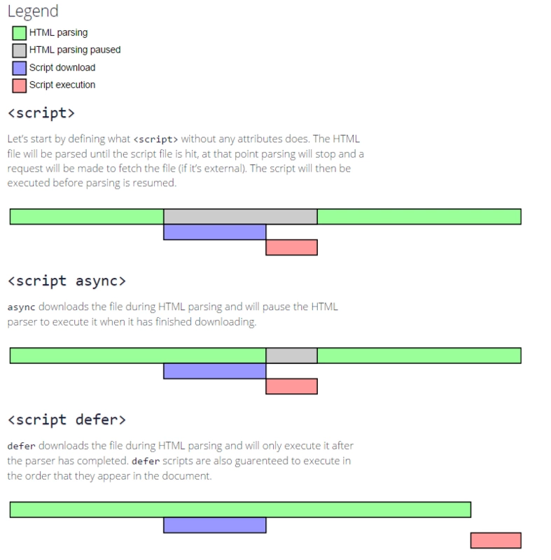

# JavaScript - 加载

## `<Script>` 标签加载

-   默认同步加载，建议把 `<script>` 标签放在 `<body>` 结尾处，这样尽可能减少页面阻塞
-   `async` 属性指定异步加载
-   `defer` 属性指定延迟加载

### `defer` 和 `async` 的区别

- `defer` 保证顺序，`async` 无序
- 有 `defer` 属性的脚本会阻止 `DOMContentLoaded` 事件，直到脚本被加载并且解析完成



## 脚本加载

```js
let script = document.createElement('script');
script.src = 'gibberish.js';
script.async = true;
document.head.appendChild(script);
```

## 加载事件

按照先后顺序：

1.  DOM 数加载完毕 `DOMContentLoaded`
2.  加载完图片等资源 `window.onload`

### 测试

```js
document.addEventListener("DOMContentLoaded", function () {
  console.log('document.DOMContentLoaded')
});

window.onload = function () {
  console.log('window.onload')
}

$(function () {
  console.log("$()")
});

$(document).ready(function () {
  console.log('$(document).ready()')
})
// 输出
// document.DOMContentLoaded
// window.onload
// $()
// $(document).ready()
```


## 参考

-   [defer和async的区别](https://segmentfault.com/q/1010000000640869)

-   [JS异步加载的三种方式](https://blog.csdn.net/l522703297/article/details/50754695)

