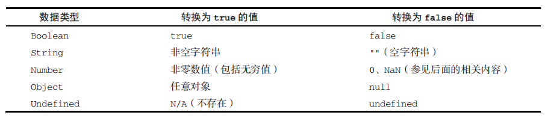
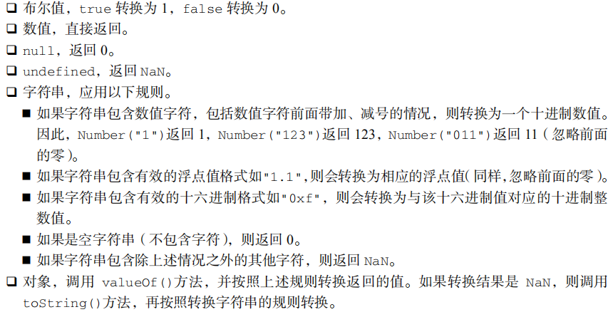

# JavaScript 知识点

## 参考资料

- 《JavaScript 高级程序设计（第4版）》[^1]

[^1]: [源码地址](https://www.ituring.com.cn/book/2472)

## `defer` 与 `async` 的区别

- `defer` 保证顺序，`async` 无序
- `defer` 保证在 `DOMContentLoaded` 事件前加载完毕


参考：

- [defer和async的区别](https://segmentfault.com/q/1010000000640869)

## `var` 与 `let` 的区别

- `var` 存在作用域提升，`let` 没有
- `var` 可以重复声明，`let` 不能
- `var` 为函数作用域，`let` 为块作用域
- 全局作用域中声明时，`var` 会成为 `window` 的属性，`let` 不会

## `for` 循环中的 `var` 与 `let`

```js
for (var i = 0; i < 5; ++i) {
	setTimeout(() => console.log(i), 0)
}
// 输出：5 5 5 5 5

for (let i = 0; i < 5; ++i) {
	setTimeout(() => console.log(i), 0)
}
// 输出：0 1 2 3 4
```

> **我的理解：**因为 lambda 表达式会对 `let` 记录一个当时的值，`var` 只会记录这个变量

## 基本数据类型

有 6 种简单类型（也称原始类型）：

- Undefined：只有一个值 `undefined`
- Null：只有一个值 `null`
- Boolean：只有 `true` 和 `false`
- Number
- String
- Symbol

1 种复杂数据类型：

- Object

### `typeof`

- `null` 认为是空对象，所以 `typeof(null)` 返回 `object`，其他都返回对应小写开头的数据类型
- 另外函数严格来讲是 Object，但是会返回 `function`

- `typeof` 声明未赋值和**未声明**的变量都返回 `undefined`

### `undefined` 和 `null`

`undefined` 是 `null` 派生来的，所以 `undefined == null` 为 `true`

## Boolean 自动转换规则

**转换规则：**



## Number 的转换规则

**转换规则：**



## 标签函数

```js
let ret = tagFun`${a} + ${b} = ${a + b}`
function tagFun(strings, ...expressions) {
  // strings 为 ${} 分割的字符串数组
  // expressions 为 ${} 中的每个表达式的值
}
```

**用标签函数实现不用标签函数拼接字符串的功能：**

```js
function noTag(strings, ...expressions) { 
  return strings[0] + expressions.map((e, i) => `${e}${strings[i + 1]}`).join(''); 
}
```

## 相等和全等

- 相等如果有一方是布尔值或数值，会转换成数值再比较
- `null == undefined`

## `for-in` 和 `for-of` 的区别

## `new` 内部过程

1. 在内存中创建一个新对象
2. 这个新对象内部的 [[Prototype]] 特性被赋值为构造函数的 prototype 属性
3. 构造函数内部的 this 被赋值为这个新对象（即 this 指向新对象）
4. 执行构造函数内部的代码（给新对象添加属性）
5. 如果构造函数返回非空对象，则返回该对象；否则，返回刚创建的新对象

## 原型对象

### 相关方法

- Object.setPrototypeOf() 可以设置原型对象，影响代码性能
- Object.getPrototypeOf()
- Object.create() 创建时指定原型对象
- Object.hasOwnProperty() 是否本身属性，`in` 包括原型

### 原型链


### 参考：

- [\_\_proto\_\_ VS. prototype in JavaScript](https://stackoverflow.com/questions/9959727/proto-vs-prototype-in-javascript)

## 迭代器

```js
[Symbol.iterator]() {
  return {
    next() {
      return {done: true, value: 1}
    }
    return() {
      // break throw 等提前退出
    }
  }
}
```

## 生成器

