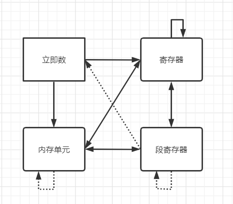

# 汇编语言（第3版）

## 第1章	基础知识

-- none --

## 第2章	寄存器

8086CPU 有**14**个寄存器，分别是：**AX、BX、CX、DX、SI、DI、SP、BP、IP、CS、SS、DS、ES、PSW**

通用16位寄存器：**AX、BX、CX、DX**，均可分为 **XH** 和 **XL**

### 8086CPU 寻址

8086CPU 是16位结构的 CPU，但是有20位地址总线，所以寻址需要通过：

```text
物理地址 = 段地址 x 16 + 偏移地址
```

>   【理解】
>
>   -   可以将起始地址为16倍数的一组内存单元定义为一个段
>   -   一个段最大的大小由偏移地址大小决定，及 2^16=64k
>   -   同一个物理地址可以对应不同的段地址和偏移地址组合

### CS 和 IP

任意时刻，CPU 将 `CS:IP` 指向的内容当做指令执行

8086CPU 的简要工作过程：

1.  从 `CS:IP` 指向的内存单元读取指令，读取的指令进入指令缓冲器
2.  `IP=IP+读取的指令长度`，指向下一条指令
3.  执行指令，转到步骤1，重复

修改 `CS:IP` 的值：

```assembly
jmp 段地址:偏移地址
jmp 合法寄存器 ; 只改变 IP 的值
```

## 实验一

### 环境搭建

使用 [DOSBoX](https://www.dosbox.com/)，模拟 DOS 环境，可以执行 `debug.exe` 等

DOSBox Options 可以配置启动时执行的命令

为了方便学习，可以将项目根目录挂载到 C 盘，工具添加到环境变量

```bash
# 将项目挂载到C盘根目录
MOUNT C C:\Users\sharon\workspace\book-assembly-language-3e
# 工具加入到环境变量
SET PATH=%PATH%;C:\tool
# 切换到C盘
C:
```

### DEBUG

```bash
# 指定地址有几种方式
不指定为当前
偏移地址
段地址:偏移地址
段地址:起始偏移地址 结束偏移地址

r # 查看寄存器内容
r ax # 改变寄存器内容

d 地址 # 查看内存中内容
d # 后续的内容

e 地址 # 修改内容
e 地址 内容 # 直接修改内容

a 地址 # 写入汇编指令

u 地址 # 查看对应汇编指令

t # 执行指令
```

## 第3章	寄存器（内存访问）

### 数据段

```assembly
; ds 指向数据段
mov ax,1000h
mov ds,ax
mov ax,[0]
```

>   8086CPU 不支持数据直接进入段寄存器

### `mov` 支持的形式

```assembly
; 根据排列组合（可以自己和自己），一共 4x4=16 种
; 除去立即数作为目的的，剩 12 种
; 再除去下面 3 种，一共有 9 种形式
; mov 段寄存器，立即数
; mov 段寄存器，段寄存器
; mov 内存单元，内存单元
mov 寄存器,立即数
mov 内存单元,立即数
mov 寄存器,寄存器
mov 段寄存器,寄存器
mov 内存单元,寄存器
mov 寄存器,段寄存器
mov 内存单元,段寄存器
mov 寄存器,内存单元
mov 段寄存器,内存单元
```



**参考：**

[汇编指令mov的集中形式](https://blog.csdn.net/tangdandang/article/details/5250368)

## 参考资料

- [FriendLey/assembly-language-learning](https://github.com/FriendLey/assembly-language-learning)

- [码龙黑曜/汇编](https://blackdragonf.github.io/all-tags/#%E6%B1%87%E7%BC%96-list)

